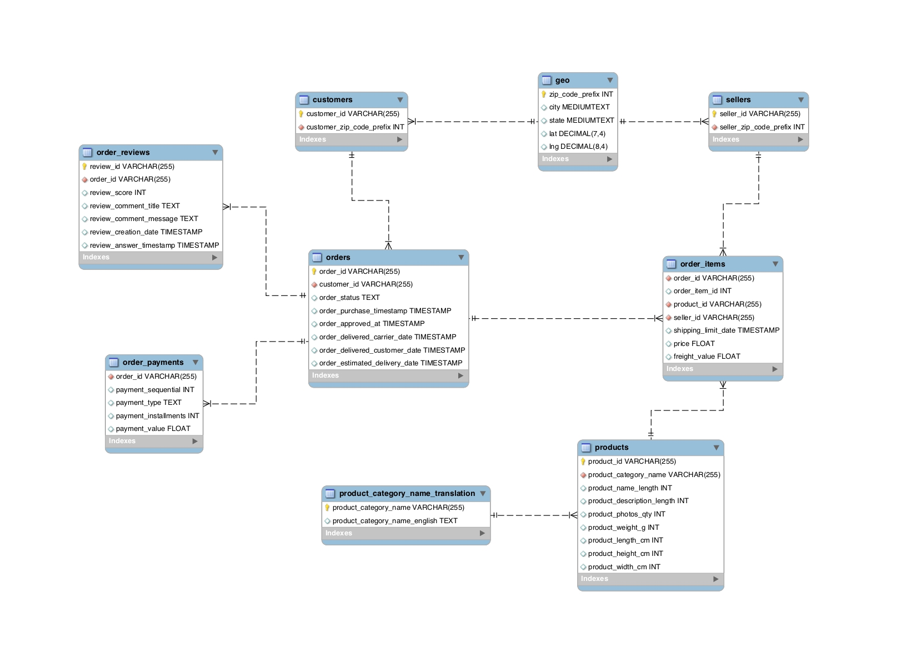

# Data Analysis & Visualization Project For Eniac:
## DataScience Bootcamp Project 1 : WBS Coding School
This project is a part of my studies at DataScience Bootcamp which covers topics such as, SQL & Tableau.
## Objective: 
To find that Magist is the best service provider for Eniac's order deliveries or not.

## Summary:
As a part of **WBS Coding School** learning exercise we got our first project which allows us to showcase our knowledge gained till now from Bootcamp.

Details of this project are as follows:

**Eniac** is an online marketplace specializing in Apple-compatible accessories in Spain & exploring an expansion to the Brazilian market. So,Here comes **Magist** a Brazilian Software as a Service company that offers a centralized order management system to connect small and medium-sized stores with the biggest Brazilian marketplaces.
**Eniac** has two main concerns:
1. Magist is a good partner for these high-end tech products.
2. Are deliveries fast enough?

## Squema

So, to guide **Eniac** with these 2 aspects, we have gathered some data from Magist & showcased the insights which will be helpful for Eniac to decide.

## Tools Used:
1. MySQL for extracting the data.
2. Tableau Public for visualizing that data.
3. Google Slides to present & summarize the data with conclusion.
   
## Datasource:
We have used Magist's database to extract the exact data & visualize it to summarize.

## Project Contributors:
Group of 4 peoples contributed in this project work.

## Key Learnings:
1. Understand the Magist's database in MySQL by reverse engineering & EER diagram.
2. Using sql queries extract the information from tables & use it solve business questions.
3. Visualize the key findings using Tableau.
4. Research the Brazilian market and put the data into context.
5. Analyzed the data & discussed within group members to reach a conclusion.
6. Present the findings with recommendation for Eniac.

## Approach
The assessment of Magist involves a comprehensive evaluation based on the following criteria:

1) Partnership Suitability: Assessing Magist’s revenue and suitability as a partner for the sale of high-quality technology products.
2) Delivery Times: Analyzing the efficiency of Magist's delivery processes and distribution of costs. Brazil average delivery times.
3) Customer Satisfaction: Evaluating customer satisfaction levels associated with Magist's services.

## Conclusion:
We have concluded our presentation as:

1.Magist is not a seller specialized in technology, only 15% of the total products are tech products, and most are considered cheap.
2.Magist is great at delivering their products on time and has fantastic customer happiness. Deliveries faster than the national average.
Based on the dimensions and shipping costs of the products in the database, it was concluded that the shipping cost was well below the normal demands. Since Magist delivers mostly heavy produts such as furniture, The freight cost is quite affordable.
3.Customer satisfaction is high. 

**We recommend Magisti as our partner when entering the Brazilian market.**

